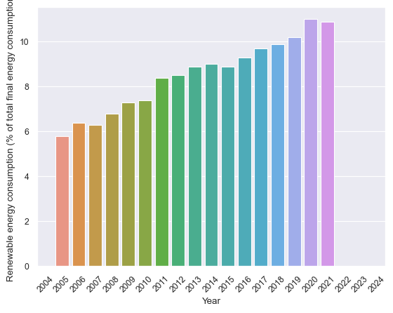
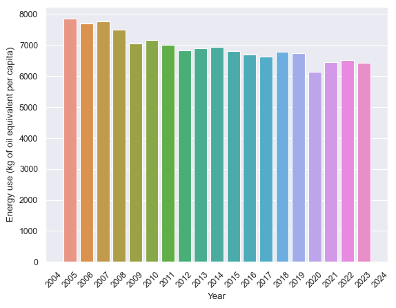
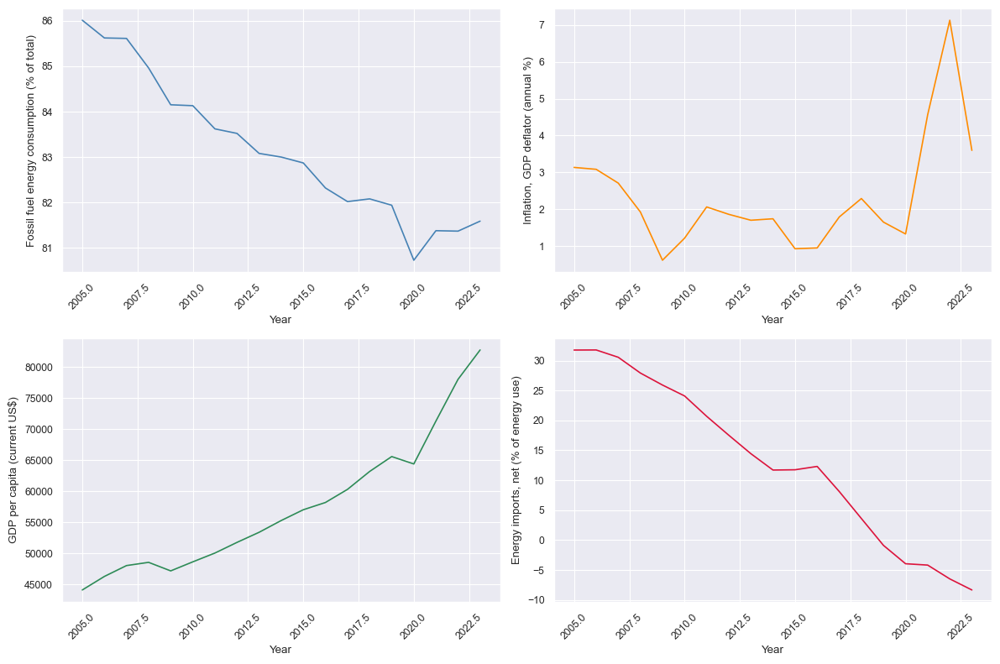
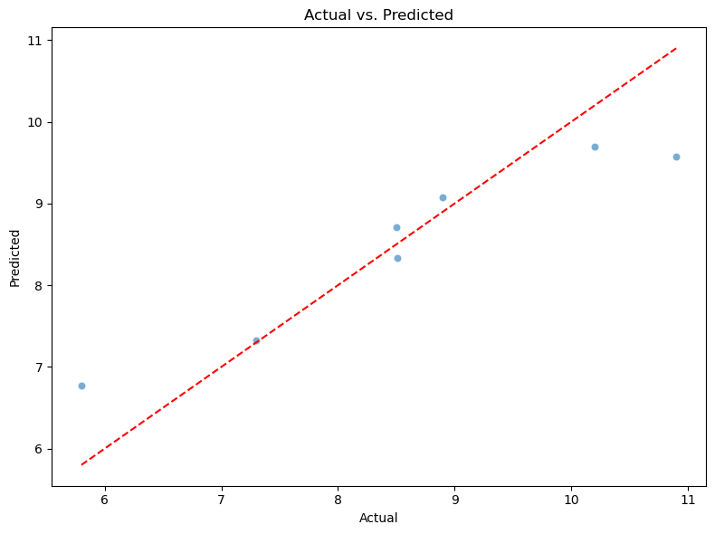
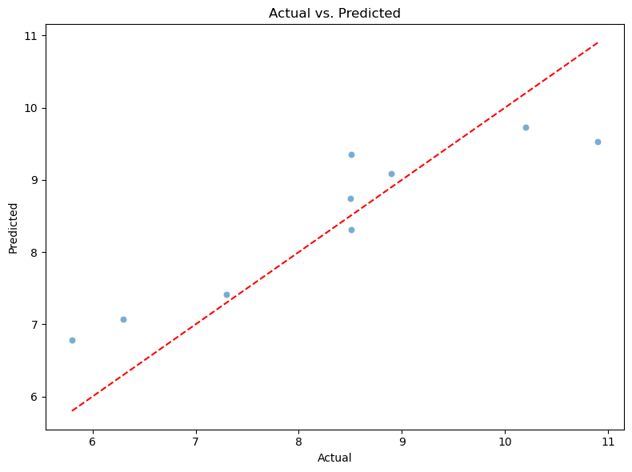

# Final Project Report 

## Table of Contents:
# 1. [Introduction](introduction)
# 2. [Methods](methods)
# 3. [Model](model)
# 4. [Discussion](discussion)

# Introduction

This project aims to use the Random Forest Regression machine learning algorithm from Sklearn to predict the level of renewable energy consumption as a percentage of total energy consumption in the United States in a given year. The data that I've collected for this project comes from the [World Bank's World Development Indicators data portal](https://databank.worldbank.org/reports.aspx?source=2&series=EG.FEC.RNEW.ZS&country=). My primary goal was to train a random forest regression model that can return a numerical estimate of the renewable energy consumption variable with an R-Squared accuracy score of over 0.75 using relevant variables from the World Bank's data. 

The code and relevant files for this project are available at this [Github Repository](...). 

# Methods 
The variables I chose to include in the model were pulled from the World Bank's API using a series of search term queries. The open access python package ["wbgapi"](https://pypi.org/project/wbgapi/) was used to facilitate the collection process. The search terms I used were as follows: energy, population, Education, emissions, interest', 'Technology', 'infrastructure', 'transport' 'internet', 'income share', 'investment in', 'Control of Corruption', 'Regulatory Quality:', 'FP.CPI.TOTL.ZG' (which provides an annual estimate of inflation based on the Consumer Price Index), and 'GDP'. 

I initially started exploring the data from these API requests by making a series of graphs based on predictions about economic and environmental trends. 

I suspected that renewable energy consumption would have experienced an overall increase over the past ten years, which aligned with this pattern that I observed in the data: 
* 

This graph highlights a steady increase in the United States' annual consumption of renewable energy as a percentage of total energy usage. I interpreted this relatively consistent pattern to imply that there may be other relevant economic, socio-political, and scientific factors influencing the public and private sectors to make more significant investments in renewables. 

The rise in consumption of renewables may not be indicative of broader trends in energy usage across the USA. I next explored overall energy consumption on a per-capita basis. The World Bank indicator I chose for this analysis was 'Energy Use' measured in equivalent kgs of oil:

* 

This graph highlights a distinct gradual decrease in per capita energy consumption over time. This may be attributed to technological innovations like the develompent of more efficient household appliances, the increased use of renewable sources, and shifting social attitudes about energy conservation. 

I also hypothesized that certain economic variables, including fossil fuel consumption, per capita GDP, inflation, and energy importation, may be important to include in our model due to their immediate influence on renewable energy trends. The trends for these variables are outlined here: 

* 

General takeaways from these plots include a notable decline in the consumption of fossil fuels, a gradual increase in per capita GDP for the US, a decline in our reliance on foreign imports for energy sources, and a significant spike in inflation, likely due to the aftermath of the COVID-19 Pandemic. These variables' relevance to U.S. energy policy make them crucial components of the model that I constructed, and these plots gave me a better understanding of the pathways through which they may influence the outcome variable of interest. 

# Model
*First Model:*

I constructed two different versions of the Random Forest Regression model. The first version featured a more simplistic build that incorporated all of the raw variables pulled from the data source via the API search queries. I then constructed a pipeline that included a 'simple imputer' function to replace missing values in the training data with the means from their respective variables. Next in the pipeline was the regression model, which was trained on 70% of the dataset. 

This first model featured a relatively high r-squared coefficient of 0.958 for its prediction accuracy on the training data, and an r-squared of 0.826 for its predictions on the testing dataset. 

Since this model included all of the variable across the dataset, it incorporated the relationships between these data and the outcome variable, which helped it fit a relatively accurate model, even though I had made no significant alterations to the pipeline before fitting the model. The first model's predictions for the testing portion of the data set can be visualized in the following graph: 

* 
**First Model**

*Second Model:*

In the second model I decided to attempt some feature engineering and clustering technicques to get a more accurate prediction score. I first identified and dropped variables that I predicted may not be immediately relevant to the outcome variable. These variables included what I deemed to be hyper-specific population demographic information, particulate matter air pollution data, and potentially irrelevant education and labor force participation rates. After dropping these variables, I added new, one-year lagged versions of original variables. I chose to include these lagged elements for variables that featured potentially relevant policy decisions, that would take at least a year to have a noticable impact on renewable energy consumption. Many of these variables included annual government investments, infrastructure trends, and expenditures for public-private partnerships. Finally, I incorporated the [kmeans clustering algorithm](https://www.geeksforgeeks.org/machine-learning/k-means-clustering-introduction/) into the new pipeline, to cluster and categorize the data based on the distance between data points and randomly specified 'cluster centroids' or means. After some parameter adjustments, the final version of this model used 6 kmeans clusters, 1 year shifts for lagged investment variables, a training set size of 60%, and 70 random forest estimators. 

Despite these additions to the prior simplistic model, this model offered slightly lower accuracy ratings, with a training r-squared score of 0.915 and a testing accuracy r-squared of 0.796. 

This graph provides a visual representation of this model's predictions for renewable energy consumption: 

* 
**Second Model**

Relative to the plot for the prior model, this graph shows more variation in the residuals, and a looser fit for the regression line through the data. The major outliers in the scatterplot also appear to be slightly further from the prediction line, introducing greater residual error. 

# Discussion:
Although both models provide a similar level of prediction accuracy, the first model was noticably more accurate despite its more simplistic construction. It is possible that because renewable energy consumption is tied to a wide variety of different factors, including climate-related scientific trends, technological innovations, economic conditions, and social pressures, implementing more raw variables from the economic indicators data source may improve these models' testing performance. Thus, dropping 'potentially irrelevant' variables from the second model may be counter productive. The kmeans algorithm may also confuse the model during the training stage by establishing associations between unrelated variables that are clustered together based on their mathematical distances instead of their real-world characteristics. In a future version of this model, I may improve its performance by implementing additional features into the data that emphasize these real-world connections between variables. Adjusting relevant variables for inflation, implementing more lagged hierarchies for investment and policy implementation variables, including rolling averages, and potentially conducting a brute-force regression scan to identify the most predictive features for the outcome variable, are some options that I would consider moving forward. 

